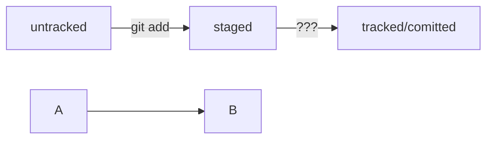

# ya

## commands:

1. git init
2. git add
3. git status
4. git commit
5. git checkout
6. git branch
7. git pull
8. git merge

```mermaid
graph LR;
  untracked -- "git add" --> staged;
  staged    -- "???"     --> tracked/comitted;

%% стрелка без текста для примера: 
  A --> B;
```
